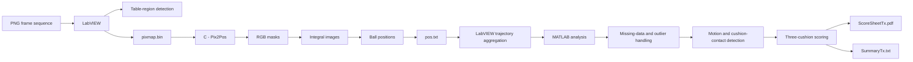

# Billiard Vision & Trajectory Analysis

[](https://github.com/guillaumesaintpierre/billiard-vision-analysis/actions/workflows/ci.yml)

Multi-language engineering pipeline for automatic analysis of **three-cushion billiards** using **LabVIEW, C and MATLAB**.

The system processes image sequences, detects the billiard table and ball positions, reconstructs trajectories, identifies motion and cushion-contact events, applies the three-cushion scoring rule, and generates a visual score sheet together with a machine-readable summary.

<p align="center">
  
</p>

> Developed as a three-person EPFL Mechanical Engineering project by Guillaume Saint-Pierre, Louis Gosset and Joseph Belamich.

## Overview

The project is organized as a complete cross-environment processing pipeline:

| Stage | Environment | Role |
|---|---|---|
| 1 | **LabVIEW** | Loads PNG frames, detects the billiard region, serializes pixel data and orchestrates the pipeline |
| 2 | **C** | Detects the red, yellow and white balls from raw RGB pixels |
| 3 | **MATLAB** | Cleans trajectories, detects motion and cushion contacts, evaluates the shot and generates outputs |

## System Architecture



## Technical Highlights

- Multi-language pipeline combining **LabVIEW, C and MATLAB**
- Raw 32-bit pixel processing in `0x00RRGGBB` format
- RGB threshold segmentation for red, yellow and white billiard balls
- **Integral-image / summed-area-table** acceleration for sliding-window scoring
- Defensive C input validation and dynamic memory management
- Stable `stderr` messages and process exit codes for LabVIEW integration
- Missing-detection handling and tracking-outlier filtering
- Trajectory reconstruction and travelled-distance computation
- Cushion-contact and motion-event detection
- Automated PDF result generation and machine-readable summary export
- Automated C validation suite executed through **GitHub Actions**

## C Ball Detection

`Pix2Pos.c` reads a binary image containing:

```text
width
height
pixel_0
pixel_1
...
pixel_N
```

Each pixel is represented as a 32-bit unsigned integer in `0x00RRGGBB` format.

The detector:

1. validates command-line arguments and image dimensions;
2. reads the binary pixmap and checks that enough pixels are available;
3. extracts the RGB channels using bit operations;
4. constructs one binary mask for each ball color;
5. converts each mask into an **integral image**;
6. slides a `BallSize × BallSize` window over the billiard region;
7. keeps the position with the highest color-match score;
8. writes the detected positions and scores to `pos.txt`.

### Why integral images?

A direct implementation would rescan all `BallSize²` pixels for every candidate position.

With a summed-area table, the score of any rectangular candidate is obtained from four array accesses:

```text
sum = D - B - C + A
```

After an `O(W × H)` preprocessing step, every candidate-window score is computed in **O(1)**.

This keeps the complete search approximately linear in the number of pixels inside the search region.

### Ball-detection output

```text
Red: x, y, score
Yellow: x, y, score
White: x, y, score
```

A ball that cannot be reliably detected is returned as:

```text
-1, -1, 0
```

## LabVIEW Orchestration

LabVIEW acts as the system orchestrator.

Its main responsibilities are:

- loading and displaying the PNG frame sequence;
- detecting the useful billiard-table region;
- exporting each frame as `pixmap.bin`;
- constructing the 29-parameter command line for `Pix2Pos`;
- launching the C executable;
- capturing external-program messages;
- parsing `pos.txt`;
- accumulating the three ball trajectories;
- generating the MATLAB analysis script;
- launching MATLAB and propagating errors through the LabVIEW error cluster.

The original VI filenames are preserved to avoid breaking internal LabVIEW references.

## MATLAB Trajectory Analysis

The MATLAB stage converts frame-by-frame detections into an interpretable shot analysis.

### Trajectory preprocessing

The script:

- converts missing detections (`-1`) to `NaN`;
- converts the image coordinate convention to MATLAB coordinates;
- fills temporary missing detections according to the project assumption that a hidden ball remains stationary;
- identifies tracking outliers using a moving-median method;
- replaces detected outliers with previous valid positions;
- computes the travelled distance of each ball.

### Event detection

The analysis then:

1. determines which ball moves first;
2. identifies when the second and third balls begin moving;
3. detects cushion-contact events for the first ball;
4. counts the contacts occurring between the second- and third-ball events;
5. applies the three-cushion scoring rule;
6. generates a score sheet and compact summary file.

## Automated Validation

The C detector is covered by a deterministic automated test suite using synthetic binary pixmaps generated at runtime.

Run it with:

```bash
make test
```

Current test coverage:

- valid detection of all three balls at known coordinates;
- truncated pixmap rejection;
- extra-pixel warning behavior;
- invalid image-dimension rejection;
- invalid `BallSize` rejection;
- graceful handling of a missing ball.

The tests use Python's standard `unittest` module and require no external Python package.

Every push and pull request triggers the same build and test sequence automatically through **GitHub Actions**.

## Error Handling

The C component distinguishes between blocking errors and non-blocking warnings.

Examples of blocking errors include:

- invalid image dimensions;
- incomplete pixmap data;
- invalid command-line parameters;
- invalid `BallSize`;
- file-access failures;
- memory-allocation failures.

Warnings are emitted for recoverable conditions such as:

- extra pixels in the binary file;
- fewer than three balls being detected.

Blocking errors are written to `stderr` and converted to stable positive process exit codes so that LabVIEW can handle them reliably.

## Example Result

A representative output is available in [`examples/T1`](examples/T1).

- [`ScoreSheetT1.pdf`](examples/T1/ScoreSheetT1.pdf) — vector score sheet
- [`SummaryT1.txt`](examples/T1/SummaryT1.txt) — machine-readable shot summary
- [`pos.txt`](examples/T1/pos.txt) — representative C detector output

The PNG preview shown at the top of this README is generated from the same result.

## Build

The standalone C component requires a C11-compatible compiler.

```bash
make
```

Equivalent direct command:

```bash
cc -std=c11 -Wall -Wextra -Wpedantic -O2 src/c/Pix2Pos.c -o Pix2Pos
```

Run the automated tests with:

```bash
make test
```

Remove compiled artifacts with:

```bash
make clean
```

## Full Pipeline Requirements

The complete end-to-end pipeline additionally requires:

- LabVIEW
- MATLAB
- a compatible frame sequence and project configuration

The C detector and its validation suite can be built and tested independently.

## Repository Structure

```text
billiard-vision-analysis/
├── .github/
│   └── workflows/
│       └── ci.yml
├── docs/
│   ├── project-report-fr.pdf
│   └── screenshots/
│       └── scoresheet-t1.png
├── examples/
│   └── T1/
│       ├── ScoreSheetT1.pdf
│       ├── SummaryT1.txt
│       └── pos.txt
├── src/
│   ├── c/
│   │   └── Pix2Pos.c
│   ├── labview/
│   │   ├── Billard2025.vi
│   │   ├── FindBillardBox.vi
│   │   ├── FrameToPositions.vi
│   │   ├── Matlab Script.vi
│   │   └── MP_LaunchMatlabScript.vi
│   └── matlab/
│       └── Analyse.m
├── tests/
│   ├── README.md
│   └── test_pix2pos.py
├── .gitignore
├── Makefile
└── README.md
```

## Limitations

This project was developed for a controlled billiards-video setup and therefore relies on several simplifying assumptions:

- fixed RGB color ranges are used for ball segmentation;
- the billiard table is assumed to be approximately aligned with the image axes;
- temporary ball occlusion is interpreted as no movement;
- the rule-analysis stage relies on frame-by-frame tracked positions rather than full physical state estimation.

Possible future improvements include adaptive color segmentation, perspective correction, more general object tracking and direct video ingestion.

## Contributors

Developed collaboratively by:

- **Guillaume Saint-Pierre**
- **Louis Gosset**
- **Joseph Belamich**

## Academic Context

Engineering programming project completed at **EPFL** within the Mechanical Engineering curriculum.

The project was designed to integrate several engineering-programming environments while emphasizing image processing, program robustness, error handling, software integration and data analysis.

## License

No open-source license is currently attached to this repository. Because this was a collaborative academic project, reuse and licensing should be agreed with all contributors.
