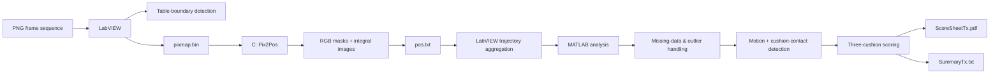
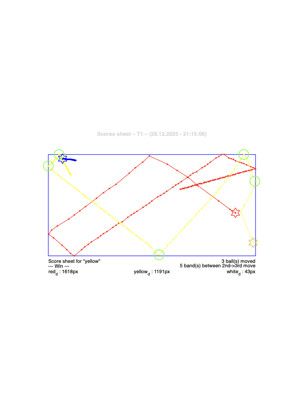

# Billiard Vision & Trajectory Analysis

[](https://github.com/guillaumesaintpierre/billiard-vision-analysis/actions/workflows/ci.yml)

Multi-language engineering pipeline for automatic analysis of **three-cushion billiards** using **LabVIEW, C and MATLAB**.

The system processes image sequences, detects the billiard table and ball positions, reconstructs trajectories, identifies motion and cushion-contact events, applies the three-cushion scoring rule, and generates a PDF score sheet plus a machine-readable summary.

> Developed as a three-person EPFL engineering project by Guillaume Saint-Pierre, Louis Gosset and Joseph Belamich.

## Overview

The project was designed as a complete cross-environment processing pipeline:

1. **LabVIEW** loads each PNG frame, detects the useful billiard-table region, serializes the image to a binary pixel map, and orchestrates the external programs.
2. **C (`Pix2Pos`)** performs RGB-based ball detection inside the table region and writes the detected positions and confidence scores.
3. **MATLAB** cleans the trajectories, detects motion and cushion contacts, evaluates the shot, and generates the final visual and text outputs.

## System Architecture



## Technical Highlights

- Multi-language pipeline combining **LabVIEW, C and MATLAB**.
- Raw 32-bit pixel processing in `0x00RRGGBB` format.
- RGB threshold segmentation for red, yellow and white billiard balls.
- **Integral-image / summed-area-table** acceleration so each sliding-window score is computed in constant time.
- Defensive C input validation, dynamic memory management and stable error reporting for LabVIEW integration.
- Handling of missing ball detections and tracking outliers.
- Vector-oriented MATLAB trajectory processing, path-length computation and event detection.
- Automatic PDF score-sheet generation and compact machine-readable result export.

## Repository Structure

```text
billiard-vision-analysis/
├── README.md
├── Makefile
├── .gitignore
├── src/
│   ├── c/
│   │   └── Pix2Pos.c
│   ├── matlab/
│   │   └── Analyse.m
│   └── labview/
│       ├── Billard2025.vi
│       ├── FindBillardBox.vi
│       ├── FrameToPositions.vi
│       ├── Matlab Script.vi
│       └── MP_LaunchMatlabScript.vi
├── docs/
│   ├── project-report-fr.pdf
│   └── screenshots/
├── examples/
└── tests/
```

## C Ball Detection

`Pix2Pos.c` reads a binary image containing image width, image height and 32-bit RGB pixels. It then:

- validates the image dimensions and command-line parameters;
- supports opposite endianness when a plausible swapped header is detected;
- builds binary masks for the three ball colors;
- builds an integral image for each mask;
- searches the billiard region for the `BallSize × BallSize` window with the highest color-match score;
- writes the result to `pos.txt` in the required format.

A missing ball is represented as `-1, -1, 0`.

### Build

On macOS/Linux with a C11 compiler:

```bash
make
```

Equivalent direct command:

```bash
cc -std=c11 -Wall -Wextra -Wpedantic -O2 src/c/Pix2Pos.c -o Pix2Pos
```

## LabVIEW Orchestration

The LabVIEW layer acts as the system orchestrator. It loads the frame sequence, detects the billiard region, exports `pixmap.bin`, launches `Pix2Pos` with the project parameters, parses `pos.txt`, accumulates ball trajectories, generates the MATLAB analysis script and launches MATLAB.

The original VI filenames are preserved in this repository to avoid breaking internal LabVIEW references.

## MATLAB Trajectory Analysis

The MATLAB analysis stage:

- converts missing detections to `NaN`;
- transforms the image coordinate convention to MATLAB coordinates;
- fills short missing-detection intervals under the project assumption that a hidden ball remains stationary;
- removes tracking outliers;
- computes travelled distance for each ball;
- determines the first, second and third balls to move;
- detects cushion-contact events for the first ball;
- applies the three-cushion rule;
- exports `ScoreSheetTx.pdf` and `SummaryTx.txt`.

## Error Handling

The C program distinguishes blocking errors from non-blocking warnings. Blocking errors are written to `stderr` and converted to stable positive process exit codes for reliable LabVIEW handling. Warnings, such as extra pixels or incomplete ball detection, are reported while allowing the pipeline to continue.

LabVIEW propagates errors through its error cluster and captures external-program output so failures can be surfaced at the orchestration level.

## Example Results

The complete pipeline produces both a visual score sheet and a compact
machine-readable summary for each analyzed sequence.

### Example — Sequence T1

<p align="center">
  
</p>

The output visualizes the reconstructed ball trajectories, initial
positions and detected cushion-contact events used for shot analysis.

The corresponding generated files are available in [`examples/T1`](examples/T1):

- [`ScoreSheetT1.pdf`](examples/T1/ScoreSheetT1.pdf) — full vector result
- [`SummaryT1.txt`](examples/T1/SummaryT1.txt) — machine-readable shot summary
- [`pos.txt`](examples/T1/pos.txt) — example output from the C ball detector

## Contributors

This project was completed collaboratively by:

- Guillaume Saint-Pierre
- Louis Gosset
- Joseph Belamich

### Guillaume Saint-Pierre — contribution

_To be completed with the exact parts implemented or led by Guillaume before the repository is published._

## Academic Context

Engineering programming project completed at **EPFL** as part of the Mechanical Engineering curriculum. The project focuses on software integration, image processing, robust program design and engineering data analysis across multiple programming environments.

## Notes on Reproducibility

The C component can be built independently with a standard C11 compiler. Full end-to-end reproduction additionally requires compatible versions of LabVIEW and MATLAB and the original image sequence / project parameters.

## License

No open-source license is currently attached to this repository. Because this was a collaborative academic project, licensing should be agreed with all contributors before publication or reuse.
